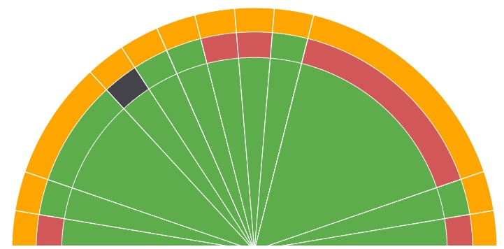

<!-- This content will not appear in the rendered Markdown or in the main page -->

# The largest heading
## The second largest heading
###### The smallest heading

## Text formatting
*Italic text*

**Bold text**

***All bold text and Italics***

**Bold text and *Italics* combined**

Now when doing <sub> subscripted text </sub> This is the way to do it
Now when doing <sup> superscripted text </sup> This is the way to do it


# Introduction:
Filemanager is a cloud based file management utility using a standard Web browser. Files uploaded to cloud are tracked for changes (version management). Users can self register and upload file, make changes and update file/s. Since it is cloud based it can be accessed from any corner of the world.
During registration, the user can set up his/her password with an email id. Thereafter users can access it from any location.

# Scope
This document describes the project details of user operations in initial sections  and then progresses to in depth details of backend later. 

Check if link is working
## Docs
* [Getting started link within this repo](Getting-started.md)
* [Relative link within this repo](doc2/hello.md)
* [Getting started outside this repo](https://scalar-labs.github.io/scalardb/)

Inserting an XML style using back ticks
```xml
<dependency>
  <groupId>com.scalar-labs</groupId>
  <artifactId>scalardb</artifactId>
  <version>3.8.0</version>
</dependency>
```

Back ticks only to highlight a text
```
Hello there 
Checking back ticks formatting
```

## Quoting code
`This` is for highlighting 'This' using back ticks in a sentence.

Format for loading relative path images:



The background color should be `#ffffff` for light mode and `#0d1117` for dark mode.

## Table display
Keep one line spacing beore adding table

| First Header  | Second Header |
| ------------- | ------------- |
| Content Cell1  | Content Cell2  |
| Content Cell3  | Content Cell4  |
| Content | -- |

Ordered list
1. Hello
2. There
3. Lets see

- Check
- This 
- Out
+ Check
+ This
+ Out2

## Task List
- [x] #739
- [ ] https://github.com/octo-org/octo-repo/issues/740
- [ ] Add delight to the experience when all tasks are complete :tada:

Need to understand this operation
<picture>
 <source media="(prefers-color-scheme: dark)" srcset="YOUR-DARKMODE-IMAGE">
 <source media="(prefers-color-scheme: light)" srcset="YOUR-LIGHTMODE-IMAGE">
 
</picture>

---
> Just to quote
